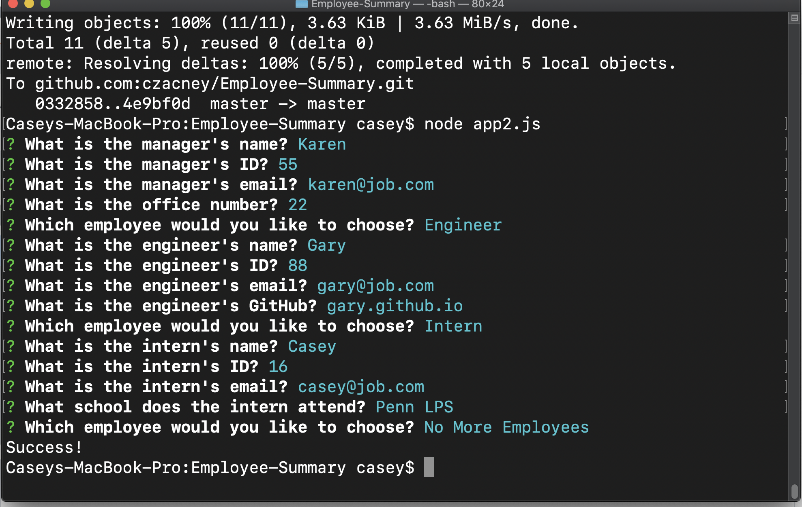

# Unit 10 OOP Homework: Template Engine - Employee Summary

## Description 

Allows users to generate an html page that displays basic employee summaries.

## Installation

Using command line & node.js, npm init, npm run test

## Usage 

Provide instructions and examples for use. Include screenshots as needed. 

## Credits

TAs, w3schools, chris lee tutoring

## Contributing

Casey Zacney
